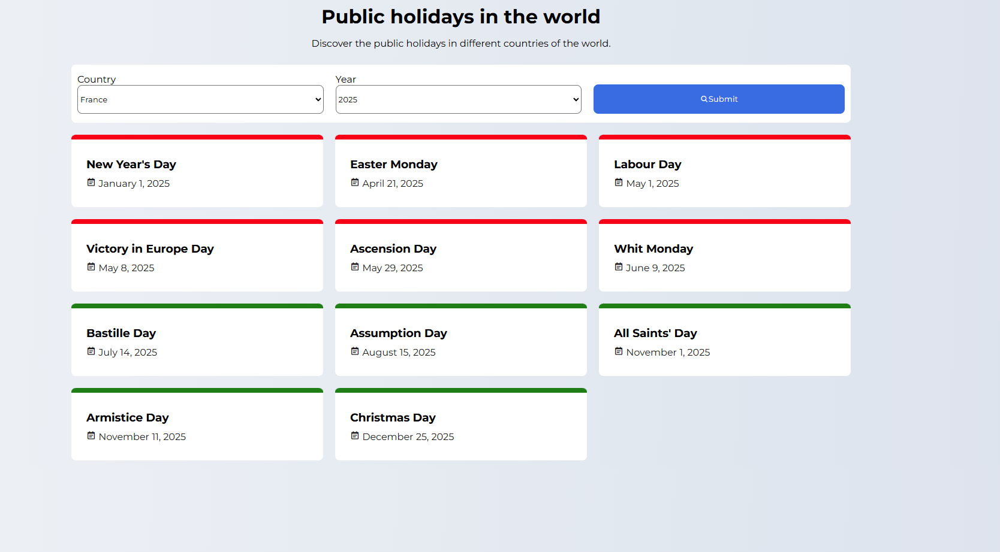

# Public Holiday

[]()

A website where you can check when are the public holidays, in every country of the world, for any given year.

## ✨ Features

- **Worldwide Coverage:** Check public holidays for any country.
- **Year Selection:** View holidays for the year of your choice.
- **Simple Search:** Easily select a country and year to get results.
- **Responsive Design:** Works on computers, tablets, and smartphones.
- **Up-to-date Data:** Uses reliable sources or APIs for accurate holiday information.

## 🛠️ Technologies Used

- **Frontend:**
  - HTML
  - CSS
  - JavaScript
- **Backend:**
  - Node.js
  - Express
  - Nager.Date API
- **Other:**
  - Git for version control

## Installation

1. **Clone the repository:**

   ```bash
   git clone https://github.com/Antoinekoe/public-holiday.git
   cd public-holiday
   ```

2. **Install dependencies (if using Node.js/Express):**

   ```bash
   npm install
   ```

3. **Start the server (if using Node.js/Express):**

   ```bash
   nodemon index.js
   ```

   The app will be accessible at `http://localhost:[PORT]` (replace `[PORT]` with the port configured in your server file, usually 3000).

## 🗂️ Project Structure

```
Public Holiday/
├── public/              # Static files
│   └── style.css        # CSS folder
|       └── styles.css   # CSS file
├── views/
|     └── index.ejs      # EJS main file
├── index.js             # Server file
├── package-lock.json    # configuration file
├── package.json         # npm configuration file
├── .gitignore           # Git ignore file
├── LICENSE              # License file
└── README.md            # This file
```

## 🤝 How to Contribute

Contributions are welcome! To contribute:

1. **Fork the repository.**
2. **Create a branch for your feature or bugfix:**

   ```bash
   git checkout -b feature/my-new-feature
   # or
   git checkout -b bugfix/bug-fix
   ```

3. **Make your changes and commit them with clear and descriptive messages.**
4. **Push your branch to your fork:**

   ```bash
   git push origin feature/my-new-feature
   ```

5. **Create a pull request (PR) to the `main` branch of the original repository.**

## 🔧 Potential Improvements (TODO)

- Add support for regional holidays within countries.
- Allow users to export holiday lists (CSV, PDF).
- Add a calendar view for better visualization.
- Support for multiple languages.
- Add notifications for upcoming holidays.
- Improve accessibility and mobile experience.

## 🔑 License

This project is licensed under the MIT License - see the [LICENSE](LICENSE) file for details.
